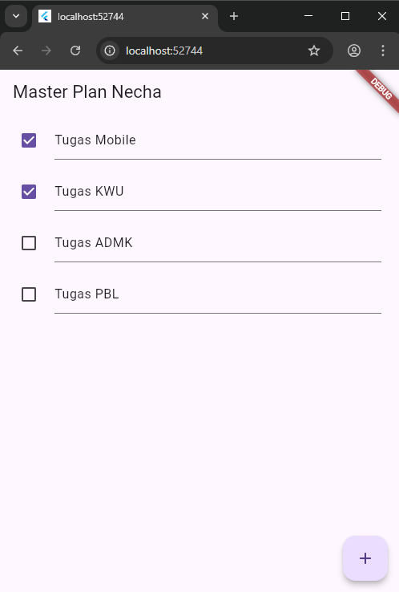
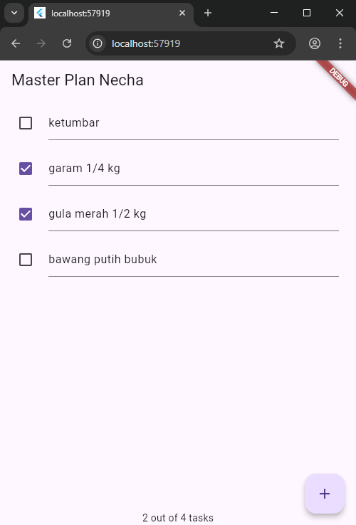
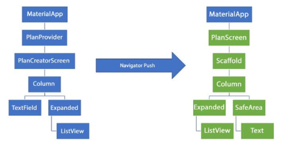
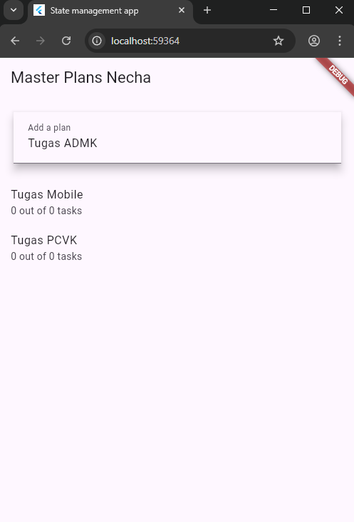

# Week 10

## Tugas Praktikum 1: Dasar State dengan Model-View
1. Selesaikan langkah-langkah praktikum tersebut, lalu dokumentasikan berupa GIF hasil akhir praktikum beserta penjelasannya di file README.md! Jika Anda menemukan ada yang error atau tidak berjalan dengan baik, silakan diperbaiki.

2. Jelaskan maksud dari langkah 4 pada praktikum tersebut! Mengapa dilakukan demikian?
* Intinya adalah untuk merapikan impor file. Daripada kita impor plan.dart dan task.dart satu per satu di file lain, kita kumpulkan keduanya di data_layer.dart. Jadi, file lain cukup impor data_layer.dart saja untuk mengakses semua model.

3. Mengapa perlu variabel plan di langkah 6 pada praktikum tersebut? Mengapa dibuat konstanta ?
* Variabel plan adalah tempat menyimpan data utama (state) yang akan ditampilkan di layar. ListView butuh data itu untuk tahu apa yang harus dirender. Alasan diawali const Plan() adalah sebagai nilai awal yang kosong saat layar pertama dibuka. Meskipun nilai awalnya const, variabel plan itu sendiri bisa diubah nilainya nanti menggunakan setState saat kita menambah atau mengedit tugas.

4. Lakukan capture hasil dari Langkah 9 berupa GIF, kemudian jelaskan apa yang telah Anda buat!

* Hasilnya adalah aplikasi to-do list sederhana yang sudah berfungsi. Kita bisa menekan tombol + untuk menambah tugas baru (baris baru). Di setiap baris, kita bisa menulis nama tugas di TextFormField dan memberi centang pada Checkbox. Setiap aksi akan memanggil setState untuk memperbarui data dan tampilan layar secara otomatis.

5. Apa kegunaan method pada Langkah 11 dan 13 dalam lifecyle state ?
* Dalam lifecycle state, initState() (Langkah 11) dipakai untuk setup awal saat widget pertama kali muncul, contohnya mendaftarkan ScrollController. Method ini hanya berjalan sekali. Sebaliknya, dispose() (Langkah 13) dipakai untuk "bersih-bersih" saat widget mau dihapus dari layar. Kita harus dispose controller di sini agar tidak boros memori (mencegah memory leak).

6. Kumpulkan laporan praktikum Anda berupa link commit atau repository GitHub ke dosen yang telah disepakati !

## Tugas Praktikum 2: InheritedWidget
1. Selesaikan langkah-langkah praktikum tersebut, lalu dokumentasikan berupa GIF hasil akhir praktikum beserta penjelasannya di file README.md! Jika Anda menemukan ada yang error atau tidak berjalan dengan baik, silakan diperbaiki sesuai dengan tujuan aplikasi tersebut dibuat.

2. Jelaskan mana yang dimaksud InheritedWidget pada langkah 1 tersebut! Mengapa yang digunakan InheritedNotifier?
* InheritedWidget adalah kelas PlanProvider itu sendiri, karena ia turunan dari InheritedNotifier. Kita menggunakan InheritedNotifier karena ini adalah InheritedWidget khusus yang bisa "mendengarkan" perubahan data. Ia terhubung dengan ValueNotifier (yang menyimpan data Plan). Ketika data di ValueNotifier berubah (misalnya, kita centang tugas), InheritedNotifier akan otomatis memberi tahu dan membangun ulang widget di bawahnya yang membutuhkannya, sehingga layar bisa update.

3. Jelaskan maksud dari method di langkah 3 pada praktikum tersebut! Mengapa dilakukan demikian?
* Dua kode itu adalah getter (pengambil data). completedCount berfungsi untuk menghitung jumlah tugas yang sudah selesai (dicentang). Sedangkan completenessMessage menggunakan hasil hitungan itu untuk membuat teks status, seperti "2 out of 4 tasks". Ini dilakukan di dalam model (Plan) agar logika bisnis terpisah dari tampilan. Jadi, kode di tampilan (PlanScreen) menjadi lebih bersih, tinggal panggil plan.completenessMessage saja tanpa perlu pusing menghitung di sana.

4. Lakukan capture hasil dari Langkah 9 berupa GIF, kemudian jelaskan apa yang telah Anda buat!

* Tampilannya sama dengan Praktikum 1, tapi cara kerjanya sekarang berbeda. State (data tugas) tidak lagi dipegang oleh PlanScreen pakai setState. Datanya sekarang dipegang oleh PlanProvider di level atas aplikasi. Tampilan ListView dan teks "2 out of 4 tasks" di bagian bawah layar sekarang otomatis update setiap kali ada perubahan data di provider, karena kita menggunakan ValueListenableBuilder untuk "mendengarkan" perubahan tersebut.

5. Kumpulkan laporan praktikum Anda berupa link commit atau repository GitHub ke dosen yang telah disepakati !

## Tugas Praktikum 3: State di Multiple Screens
1. Selesaikan langkah-langkah praktikum tersebut, lalu dokumentasikan berupa GIF hasil akhir praktikum beserta penjelasannya di file README.md! Jika Anda menemukan ada yang error atau tidak berjalan dengan baik, silakan diperbaiki sesuai dengan tujuan aplikasi tersebut dibuat.

2. Berdasarkan Praktikum 3 yang telah Anda lakukan, jelaskan maksud dari gambar diagram berikut ini!

* Gambar diagram itu menjelaskan alur navigasi aplikasi dari dua layar utama. Sisi kiri (biru) adalah PlanCreatorScreen, yaitu layar utama yang menampilkan semua daftar plan (rencana) dan punya TextField untuk menambah plan baru. Sisi kanan (hijau) adalah PlanScreen, yaitu layar detail untuk tugas-tugasnya. Tanda panah Navigator Push menunjukkan aksi ketika pengguna mengetuk salah satu plan di layar kiri; aplikasi akan berpindah (navigasi) ke layar kanan untuk menampilkan detail tugas dari plan yang dipilih tersebut.

3. Lakukan capture hasil dari Langkah 14 berupa GIF, kemudian jelaskan apa yang telah Anda buat!

* Hasil akhir fungsionalnya adalah aplikasi yang memiliki dua jenis layar. Layar utama (PlanCreatorScreen) adalah tempat kita bisa mengetik nama plan baru di bagian atas (misal: "Tugas ADMK") lalu menambahkannya ke daftar. Di bawahnya, akan tampil daftar semua master plan yang telah dibuat (misal: "Tugas Mobile", "Tugas PCVK") beserta ringkasan progresnya. Jika salah satu plan di daftar itu diketuk (tap), aplikasi akan berpindah ke layar detail (PlanScreen), tempat kita bisa menambah, mengedit, dan mencentang tugas-tugas (tasks) khusus untuk plan yang dipilih tadi.

4. Kumpulkan laporan praktikum Anda berupa link commit atau repository GitHub ke dosen yang telah disepakati !