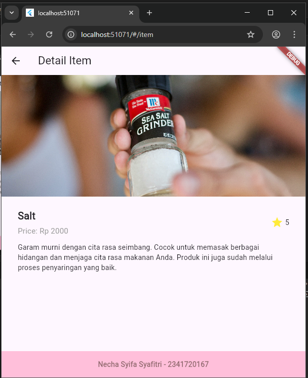

# layout_flutter

## Praktikum 1: Membangun Layout di Flutter

## Praktikum 2: Implementasi button row

## Praktikum 3: Implementasi text section

## Praktikum 4: Implementasi image section

## Praktikum 5: Membangun Navigasi di Flutter

## Tugas Praktikum 2

