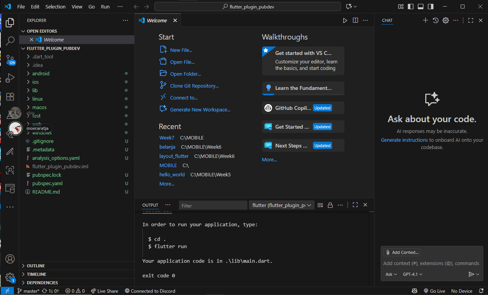
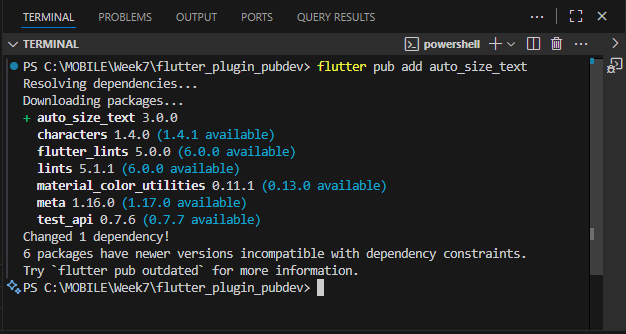
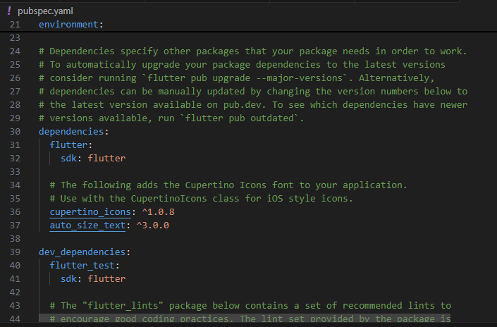
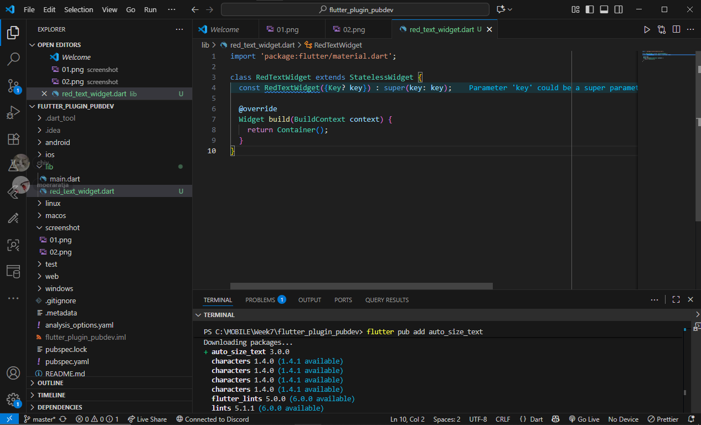
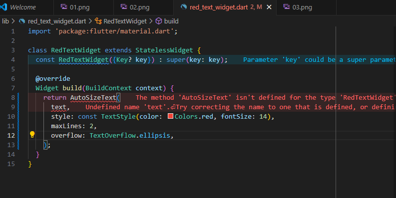
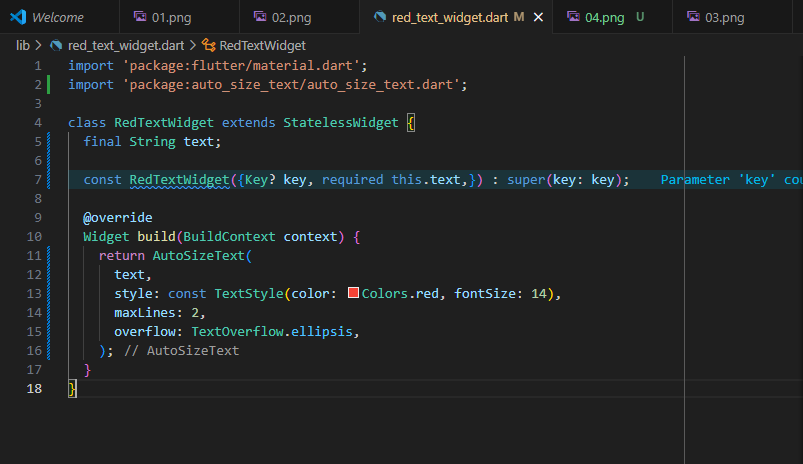
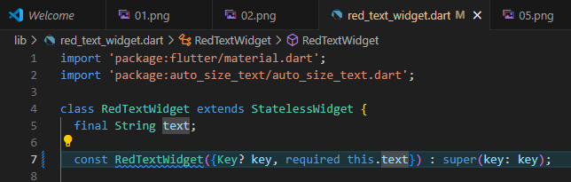
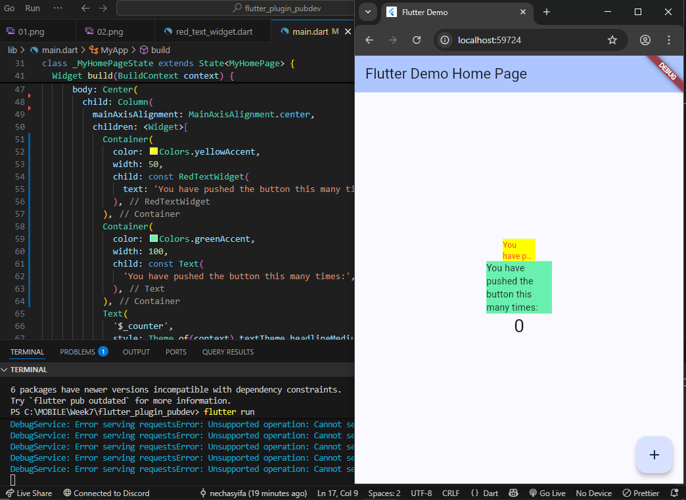

# flutter_plugin_pubdev

## Praktikum Menerapkan Plugin di Project Flutter
### Langkah 1: Buat Project Baru

### Langkah 2: Menambahkan Plugin

* Langkah 2 bertujuan untuk menambahkan plugin auto_size_text ke dalam proyek Flutter agar bisa digunakan untuk membuat teks yang otomatis menyesuaikan ukuran fontnya sesuai ruang yang tersedia. Dengan perintah flutter pub add auto_size_text, plugin tersebut akan diunduh dan didaftarkan secara otomatis di file pubspec.yaml pada bagian dependencies. Sehingga proyek Flutter sudah dapat mengenali dan bisa menggunakan fitur yang disediakan oleh plugin tersebut tanpa perlu membuat fungsinya sendiri dari nol.

### Langkah 3: Buat file red_text_widget.dart

### Langkah 4: Tambah Widget AutoSizeText

* Error terjadi karena tidak ada import untuk plugin auto_size_text, sehingga Flutter tidak mengenali widget AutoSizeText. Selain itu, variabel text belum dideklarasikan di kelas RedTextWidget, menyebabkan error undefined name 'text'.

### Langkah 5: Buat Variabel text dan parameter di constructor

* Langkah 5 dilakukan untuk memperbaiki error yang muncul karena variabel text belum didefinisikan. Dengan menambahkan final String text; dan parameter required this.text pada constructor, widget RedTextWidget menjadi bisa menerima teks dari luar saat dipanggil. Jadi, ketika widget ini digunakan di file lain seperti main.dart, kita bisa menentukan teks apa yang akan ditampilkan oleh widget tersebut.

### Langkah 6: Tambahkan widget di main.dart

* Pada langkah 6, terdapat dua widget yaitu RedTextWidget dan Text. Keduanya berfungsi untuk menampilkan teks di layar, namun ada perbedaannya. RedTextWidget menggunakan plugin AutoSizeText sehingga ukuran teksnya bisa otomatis menyesuaikan ruang yang tersedia agar tetap terlihat rapi tanpa terpotong. Sedangkan widget Text biasa tidak memiliki kemampuan menyesuaikan ukuran secara otomatis, sehingga teks bisa terpotong jika ruangnya terlalu sempit.

#### Jelaskan maksud dari tiap parameter yang ada di dalam plugin auto_size_text berdasarkan tautan pada dokumentasi ini!
* Pada plugin auto_size_text, parameter text digunakan untuk menentukan isi teks yang akan ditampilkan. Parameter style berfungsi untuk mengatur tampilan teks seperti warna, ukuran font, dan jenis huruf. Parameter maxLines digunakan untuk menentukan jumlah baris maksimal yang boleh ditampilkan sebelum teks terpotong. Sementara parameter overflow menentukan bagaimana teks yang melebihi batas akan ditampilkan, misalnya dengan tanda titik-titik (TextOverflow.ellipsis). Secara keseluruhan, parameter-parameter ini membantu mengatur agar teks terlihat rapi dan tetap terbaca di berbagai ukuran layar.