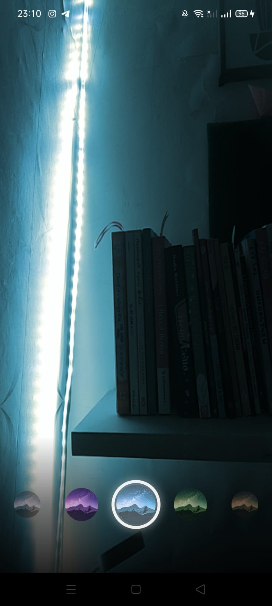
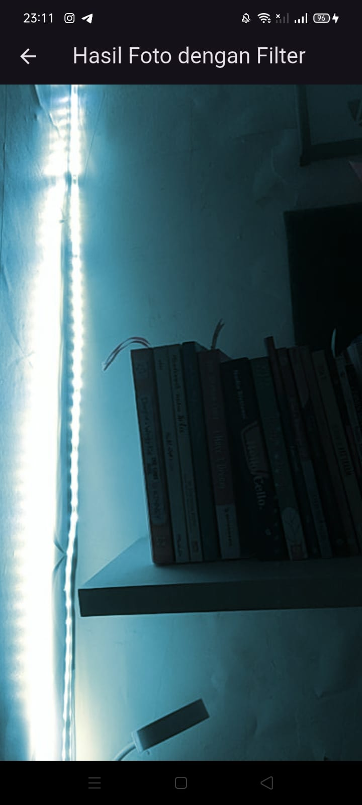

# Week 9

## Praktikum 1: Mengambil Foto dengan Kamera di Flutter

## Praktikum 1: Membuat photo filter carousel

## Tugas Praktikum
1. Selesaikan Praktikum 1 dan 2, lalu dokumentasikan dan push ke repository Anda berupa screenshot setiap hasil pekerjaan beserta penjelasannya di file README.md! Jika terdapat error atau kode yang tidak dapat berjalan, silakan Anda perbaiki sesuai tujuan aplikasi dibuat!

2. Gabungkan hasil praktikum 1 dengan hasil praktikum 2 sehingga setelah melakukan pengambilan foto, dapat dibuat filter carouselnya!

* Hasil:

3. Jelaskan maksud void async pada praktikum 1?
* void async menandakan sebuah fungsi yang tidak mengembalikan nilai apa pun (void), namun dapat menjalankan tugas yang butuh waktu lama (async). Di praktikum 1, ini dipakai agar aplikasi bisa menunggu (menggunakan await) tugas seperti inisialisasi kamera atau pengambilan foto selesai, tanpa membuat seluruh tampilan aplikasi macet saat proses itu berjalan.

4. Jelaskan fungsi dari anotasi @immutable dan @override ?
* @immutable adalah penanda untuk class (seperti StatelessWidget) yang memberi tahu flutter bahwa data di dalam class itu tidak akan pernah berubah setelah dibuat, sehingga Flutter bisa mengoptimalkan performanya. Sedangkan @override adalah penanda untuk sebuah method (seperti build() atau initState()) yang menunjukkan bahwa method itu sengaja menimpa atau menggantikan method dengan nama yang sama dari class induknya, yang membantu compiler mengecek agar tidak salah ketik nama method.

5. Kumpulkan link commit repository GitHub Anda kepada dosen yang telah disepakati!